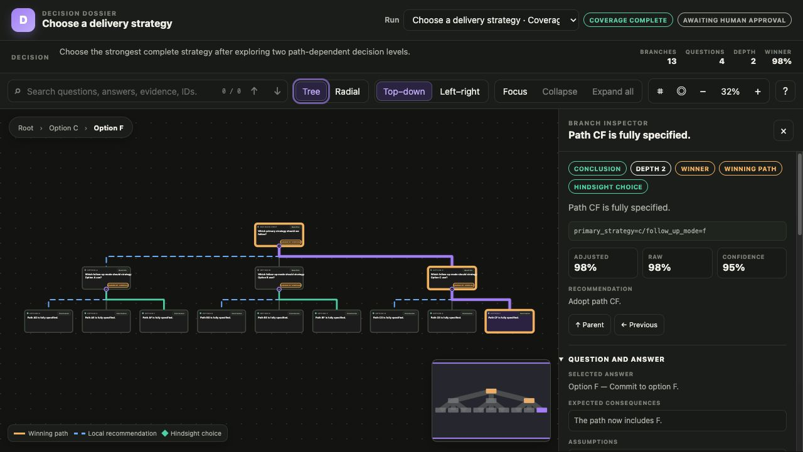

# Decision Deliberation

[](https://github.com/katooling/decision-deliberation/actions/workflows/ci.yml)
[](https://github.com/katooling/decision-deliberation/releases)
[](LICENSE)

Explore a bounded decision tree with structured agent judgment, deterministic branch creation, backwards hindsight, and a navigable evidence dossier.

> Public preview: the core behavior is tested and replayable, but schemas and CLI flags may change before `1.0.0`. The system recommends decisions for human approval; it never executes them.



## Why this exists

A normal design discussion can commit early to the first plausible option. Decision Deliberation keeps admitted alternatives alive, asks path-dependent follow-up questions, evaluates complete paths against one rubric, and then works backwards to show which earlier answers produced the strongest outcomes.

The controller—not an agent—owns IDs, schemas, traversal, branch creation, persistence, stopping rules, and reduction. Agents supply structured questions, criticism, evidence, and evaluation.

## What you get

- deterministic BFS and DFS traversal;
- coverage and budget policies with honest partial results;
- independent proposer, reviewer, synthesizer, and evaluator calls;
- one code-created branch for every admitted answer;
- append-only events and provider-free replay;
- ranked alternatives, assumptions, uncertainty, and human approval state;
- hindsight comparison between local recommendations and final outcomes; and
- a read-only tree and radial viewer with search, minimap, focus, breadcrumbs, deep links, and a detailed inspector.

## Install the public preview

Requires Node.js 24 or newer.

Install the versioned release artifact from GitHub:

```bash
npm install --global \
  https://github.com/katooling/decision-deliberation/releases/download/v0.1.0/decision-deliberation-0.1.0.tgz
deliberate --version
```

The package is intentionally not published to the npm registry yet. Registry distribution is a later product decision; the GitHub release remains the canonical `0.1.0` artifact.

## Run the demo from source

```bash
git clone https://github.com/katooling/decision-deliberation.git
cd decision-deliberation
npm ci
npm run cli -- run examples/demo/request.json \
  --config examples/demo/config.json \
  --provider examples/demo/provider.json \
  --out runs \
  --run-id demo
npm run view -- --runs runs
```

Open `http://127.0.0.1:4173` and select the complete run. The demo explores all nine paths beneath `A/B/C → D/E/F`. Its question-time recommendation starts with `A`; hindsight selects `C → F` after comparing the complete leaves.

Generated run artifacts:

- `events.jsonl`: append-only source history;
- `graph.json`: replayed decision tree;
- `dossier.json`: machine-readable recommendation and alternatives;
- `dossier.md`: human-readable result; and
- `calls/`: provider requests, raw outputs, validation results, and usage metadata.

Run artifacts may contain sensitive decision context. Keep real runs out of public repositories.

## Connect an agent

The command provider launches one configured process per call without a shell. It writes an `AgentRequest` JSON document to stdin and expects:

```json
{
  "text": "<result>{...role-specific structured output...}</result>",
  "usage": {
    "inputTokens": 100,
    "outputTokens": 50,
    "costUsd": 0.001,
    "latencyMs": 500
  }
}
```

Provider configuration:

```json
{
  "type": "command",
  "command": "node",
  "args": ["path/to/your-agent-adapter.mjs"]
}
```

The same boundary can wrap a local model, hosted API adapter, or isolated agent runner. Provider commands are trusted local configuration and should not contain embedded credentials.

## Inspect a saved decision

```bash
deliberate status --run-id demo --out runs
deliberate replay --run-id demo --out runs
deliberate approve --run-id demo \
  --decision approved \
  --by "Your name" \
  --out runs
```

Approval appends a decision record; it does not perform the recommended action.

## Evidence boundary

```bash
npm run bench
```

The included benchmark proves traversal and hindsight behavior on seeded closed-world fixtures. It does not prove broad superiority over people, one strong model call, or every normal design process. The [benchmark contract](docs/benchmark.md) defines the live, compute-matched comparison needed for stronger claims.

## Use it when

- a decision has real path dependencies;
- several options deserve explicit downstream exploration;
- assumptions and evidence must remain inspectable; or
- you want to compare bootstrap configurations and stopping policies.

Do not treat it as an oracle, a substitute for domain experts, or an automatic executor. High-impact decisions still need appropriate human and organizational review.

## Project map

- [Domain language](CONTEXT.md)
- [Architecture and invariants](DESIGN.md)
- [Decision records](docs/adr/)
- [Viewer contract](docs/viewer.md)
- [Open-source readiness plan](docs/open-source-plan.md)
- [Product plan and success measures](docs/product-plan.md)
- [Release process](docs/releasing.md)
- [Contributing](CONTRIBUTING.md)
- [Support](SUPPORT.md)
- [Security](SECURITY.md)

## License

[MIT](LICENSE)
